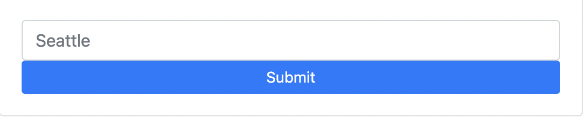
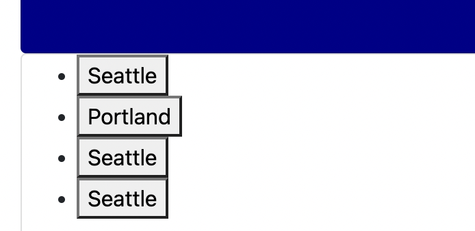

# *** Progressive-Web-Applications- ***
[GitHub Repository](https://github.com/scarfrae/City-Weather-Dashboard)

[Deployed Application](https://scarfrae.github.io/City-Weather-Dashboard/)

<!-- deployed application -->
## **Description** 📚

*City-Weather-Dashboard * This assignment is purposed at helping travelers search for the weather in different cities including current and future conditions. When presented with current weather conditions, the traveler is presented with UV index, wind speed, humidity, temperature along with an icon displaying the conditions, the date and the city. This information is called from an API and the program uses local storage to show past searches..

## **Table of Contents** 📄

* Installation
* Usage
* License
* Contributing
* Testing
* Technology
* Questions

---

## **Installation** ⚙️

Visit my [repository](https://github.com/scarfrae/City-Weather-Dashboard) to reference: any materials and my process in developing the web page. Visit my [Deployed Application](https://scarfrae.github.io/City-Weather-Dashboard/) to use the webpage.

### **Usage** 💻
* Users can search for a city via the textbox and the submit button

* They can view and submit previous searches by pressing the button of the previous city 

### **License** 💳

MIT License

Copyright © 2022

Permission is hereby granted, free of charge, to any person obtaining a copy of this software and associated documentation files (the "Software"), to deal in the Software without restriction, including without limitation the rights to use, copy, modify, merge, publish, distribute, sublicense, and/or sell copies of the Software, and to permit persons to whom the Software is furnished to do so, subject to the following conditions:

The above copyright notice and this permission notice shall be included in all copies or substantial portions of the Software.

THE SOFTWARE IS PROVIDED "AS IS", WITHOUT WARRANTY OF ANY KIND, EXPRESS OR IMPLIED, INCLUDING BUT NOT LIMITED TO THE WARRANTIES OF MERCHANTABILITY, FITNESS FOR A PARTICULAR PURPOSE AND NONINFRINGEMENT. IN NO EVENT SHALL THE AUTHORS OR COPYRIGHT HOLDERS BE LIABLE FOR ANY CLAIM, DAMAGES OR OTHER LIABILITY, WHETHER IN AN ACTION OF CONTRACT, TORT OR OTHERWISE, ARISING FROM, OUT OF OR IN CONNECTION WITH THE SOFTWARE OR THE USE OR OTHER DEALINGS IN THE SOFTWARE.

### **Testing** 📝
All testing was done by the developing team.

### **Technology** 💡
* Javascript
* Bootstrap
* Css
* Html 

### **Contact** ☎
* Sterling Cafrae **-** [Github](https://github.com/scarfrae)**,** [LinkedIn](https://www.linkedin.com/in/sterling-carfrae-a2a8151a5/)
...
***

